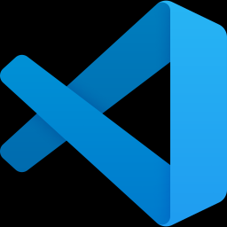

# Using an IDE (_Visual Studio Code_)

## Why?

A good IDE (= integrated development environment) can boost your coding productivity tremendously.
After getting used to its advanced editing features, syntax highlighting, intelligent code completion, and debugging capabilities, you won't want to go back to a simple text editor.
While in the previous chapter we used `git` from the command line, the built-in git support makes it unnecessary to remember the git command syntax.

The majority of php developers use either `Visual Studio Code` or `PhpStorm`. In this playground we will look at VS Code.

## Installing and using VS Code

A proper `Visual Studio Code` tutorial is beyond the scope of this article.
Just grab it from its [website](https://code.visualstudio.com/) and install.
There are good _Getting Started_ guides available, and basic usage is quite intuitive.
If you start the IDE with `code .` from the directory you created for your git repo, the repo will be opened and VS Code's Explorer tab will show all your files within the repo.

## Extensions

One of the main strength of `VS Code` lies in the huge number of extensions available.
Most of the standalone dev tools I will cover in a later chapter also has an extension for VS Code as well.
This integrates them even better with the IDE.

Some useful extensions for php developers:

* [PHP Intelephense](https://marketplace.visualstudio.com/items?itemName=bmewburn.vscode-intelephense-client) by Ben Mewburn
* [PHP Debug](https://marketplace.visualstudio.com/items?itemName=xdebug.php-debug) by Xdebug
* [php cs fixer](https://marketplace.visualstudio.com/items?itemName=junstyle.php-cs-fixer) by junstyle
* [phpcs](https://marketplace.visualstudio.com/items?itemName=ikappas.phpcs) by Ioannis Kappas
* [Composer Companion](https://marketplace.visualstudio.com/items?itemName=faelv.composer-companion) by faelv
* [Better PHPUnit](https://marketplace.visualstudio.com/items?itemName=calebporzio.better-phpunit) by calebporzio

Please note, that some extensions need additional configuration to work correctly. Check their individual documentation if using them.

## Useful links

* [Visual Studio Code](https://code.visualstudio.com/)
* [PhpStorm](https://www.jetbrains.com/phpstorm/), another great IDE, still the most popular one for PHP. Unfortunatelly it is not free.

## Coming next

It happens even to the best of us, that the code we write has some bugs. How to find and correct them the the easiest?
