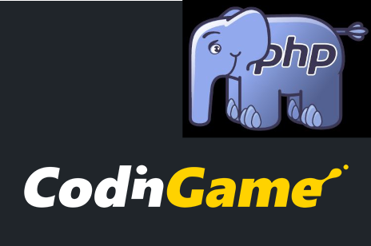

# PHP Dev Tools (for CodinGame or anywhere else)

## Intro

[CodinGame](https://www.codingame.com/) is a great coding site where you can practice and improve your coding skills in a fun way by solving puzzles or writing bots for multiplayer games.

At `CG` you don't really have to bother about setting up any local development environment: just start to write your code directly on the CG website using your browser, run there the provided test cases (for solo puzzles), and submit your solution when you feel ready.

Despite this, it brings some advantages if you make the effort and spend some time to set up a local dev environment with some additional tooling - especially if you already have lots of puzzle solutions and some longer or more complex code as well.
The experience will also come in handy in other projects, outside the context of CodinGame.
Most of the discussion in this playground is also applicable elsewhere.

## Contents

This `Tech.io` playground explores several tools to make your life easier as a developer. Topics we will cover:

* Running your code locally (_php_)
* Using a code repository (_git, GitHub_)
* Using an IDE (_Visual Studio Code_)
* Finding bugs (_Xdebug_)
* Checking and fixing the coding style (_PHP CodeSniffer, PHP CS Fixer_)
* Static code analysis to catch bugs BEFORE you run the code (_PHPStan_)
* Some great _CodinGame-specific_ tools and websites by the community

We will also very briefly touch some tools that are not relevant when solving CodinGame puzzles, but it is still good to know about them for other projects:

* Using a dependency manager (_Composer_)
* Unit testing (_PHPUnit, PEST_)
* Generating documentation (_phpDocumentor_)

## Goals and non-goals

My goal with this playground is NOT to provide a full tutorial for each tool, I will really just highlight the basics (with an extra emphasis on __why__ to use them), and also show __how__ I personally use them with my CG activities.
I will try to be _beginner-friendly_. (Professional php developers are surely using most of these tools already...)
To limit article length, I still cannot cover all the details of the installation and usage.
Links are provided if you need to go deeper.

I will also not discuss any puzzle, algorithm, or the `PHP` language itself here, the topic is solely the __dev environment and tooling__.
While the specific discussion is for PHP, most topics (especially the _Why?_ parts) are valid for other languages as well (even the specific toolset would be different).

## Contributions welcome

If you have suggestions for improvements for this playground, please:

* send me ([TBali](https://www.codingame.com/profile/08e6e13d9f7cad047d86ec4d10c777500155033)) a __private message__ on CodinGame;
* or give a __pull request__ directly to the [github repo](https://github.com/tbali0524/playground-c2779db2) of this playground;
* or just leave a comment here on `Tech.io`.

## Let's get started!
