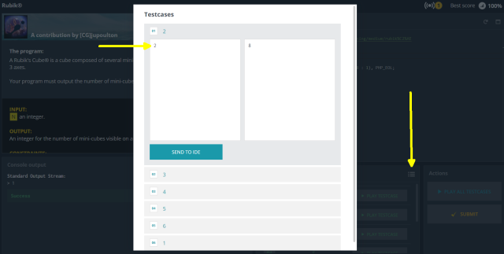

# Running your code locally (_php_)


## Why?

So, if `CodinGame` provides everything, including a runtime environment, why do we need at all to be able to run your code locally?

Well, in 95% of the cases we just don't. But it can make sense when:

* If you have a non-obvious bug, it is much easier to __debug__ it in the IDE, using breakpoints, line-by-line execution, variable inspection, etc. _(More details in a later chapter.)_
* If you have __timeout__ in a CG puzzle, you might want to know how 'far' are you from passing. So run it locally without the time constraint, measure the running time with `hrtime()`, and print it to the console.
* For some optim puzzles you can pre-calculate some validator results locally without the time constraint, then __hard-code__ it. It means that in the submitted code you just detect the input and send the correct output you already stored in your source as some string. Not a nice thing, feels a bit like a hack. I tried out this approach only in the [2048 puzzle](https://www.codingame.com/multiplayer/optimization/2048).
* To improve your bot in [bot programming games](https://www.codingame.com/multiplayer/bot-programming) or contests, you can set up local __self-play__ to try out new things without submitting to the arena. I used this approach to fine-tune some hyper-parameters ('magic constants' for an evaluation function) in my code.

## Installing `PHP`

Depending on your OS, `php` might come already preinstalled, although it might be an older release.
Try it out with `php --version`. While at the time of this writing CodinGame shamefully supports only `v7.3` (released in 2018...), for your local environment you should go for the latest stable release (`v8.1` till end of 2022).

* If using `Ubuntu 20.04 LTS` (directly or with `Windows Subsystem for Linux (WSL)`), it came with php `v7.4` only, so there you needed to add an extra _PPA_ repository to upgrade. However, `Ubuntu 22.04 LTS` already contains php `v8.1`, so it is best to upgrade the whole OS. Other Linux distros might have different status regarding php versions.

* For `Windows` you can download and unzip the latest release from the [core php site](https://windows.php.net/download).
    * You shall add its directory to the `PATH`, so you can run `php` from anywhere.
    * Copy the provided sample settings file `php-development.ini` to `php.ini`. There are lot of settings there, but 99% is just fine how it is.
    * The extension libraries are disabled by default. In `php.ini` look for the section with the `;extension=` lines and remove the trailing `;` to enable what you need. Most of the extensions you would need only for web applications, but not for CG puzzles. Some CG puzzles might need `mbstring`. Some other useful libraries such as `bcmath` and `ctype` are now part of the core, so always available (at least if compiled into php, but that is the case with the Windows distribution we downloaded).
    * The default memory setting is too low for some puzzles, increase it with `memory_limit = 768M` to match the CG environment, or you can even set it to unlimited with `memory_limit = -1`.

* You might find it more convenient to use a pre-packaged version. I use [XAMPP](https://www.apachefriends.org/) that contains some additional useful stuff, such as a web server and a database besides PHP itself. (These are not needed for CodinGame puzzles though.) There are other similar packages as well.
    * You might still need to tweak `php.ini` settings to your liking.

* `Mac` users: I have no experience with it, so just google it...

* Using Docker containers is also possible, but setting up docker is beyond our scope, and I think it is a bit overkill for just solving some CG puzzles.

## Optional: enabling JIT

In the default php config file the JIT compiler (available from `v8.0`) is turned off.
While not a huge boost for typical web applications, for a computing-intensive CG puzzle the speedup is usually substantial: in my experience _2x_ to _3x_.

To enable JIT, just uncomment / add / modify the following lines in your `php.ini` file:

```ini
zend_extension=opcache
opcache.enable = 1
opcache.enable_cli = 1
opcache.jit_buffer_size = 256M
opcache.jit = tracing
```

You can check if JIT is working by running:

```bash
php -r "var_dump(opcache_get_status()['jit']);"
```

## Running a puzzle solution locally

While solo puzzle test cases are handled automaticaly on the CG site, locally we have to set up the input manually (as we do not want to type them at every run).
In case of a solo puzzle, just select a testcase and copy-paste the input into a local file:



After saving the input to `input_01.txt`, run the test case with:

```bash
php my_solution.php < input_01.txt > output_01.txt 2>&1
```

...and check the result (what your code wrote to the standard output) in `output_01.txt`.

* _Note:_ By adding `2>&1` above, we redirected the error log also to the same file.

* _Beware:_ When creating a local test case input file, make sure to save it with Linux line ending `LF` instead of the Windows default `CRLF`, otherwise the input parsing might not work correctly.

* To run multiple test cases after each other, you can make a small batch file or shell script by copying and editing the above command line with different filenames.

## Useful links

* [PHP.net](https://www.php.net/), the core language site (language documentation, releases, etc).
* [XAMPP](https://www.apachefriends.org/), a pre-packaged php distro for Windows, Max or Linux (includes Apache httpd, MariaDB, PHP, Perl, Tomcat, phpMyAdmin)

## Coming next

Okay, we run our `php` code locally. But where shall we store our code?
